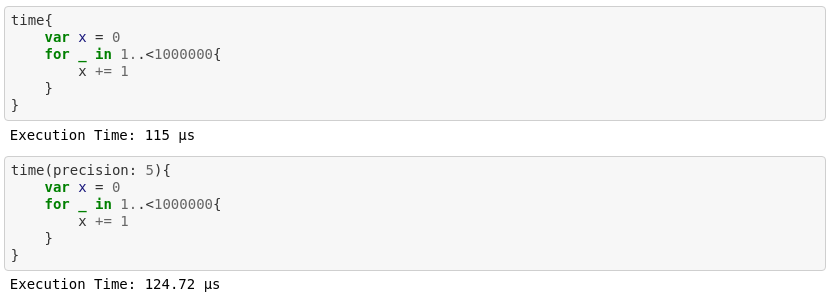

# SwiftTimeIt

A TimeIt function written in swift based loosely after [IPython timeit magic](https://github.com/ipython/ipython/blob/master/IPython/core/magics/execution.py).

## Installation

In Swift Jupyter Notebook:
```
%install '.package(url: "https://github.com/bhansconnect/SwiftTimeit", from: "1.0.0")' SwiftTimeit
import SwiftTimeit
```

## Usage

Use time to measure the execution time of a function once.
It is not accurate for short functions.


Use timeit to accurately measure the execution time of a function.
Timeit will atomacitically calculate the number of loops to run to get sufficient accuracy, if loops is not specified.
Timeit will let you know if there is a large difference between best and worst case execution.


See [TimeitExample.ipynb](TimeitExample.ipynb)
